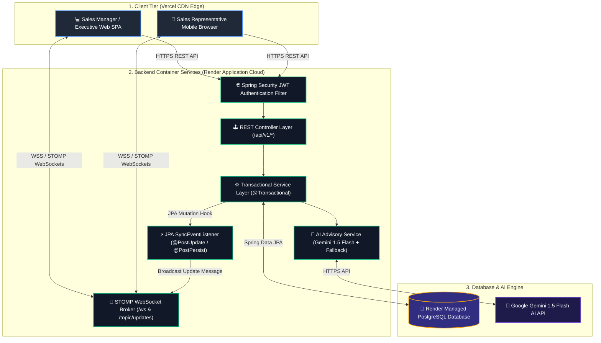
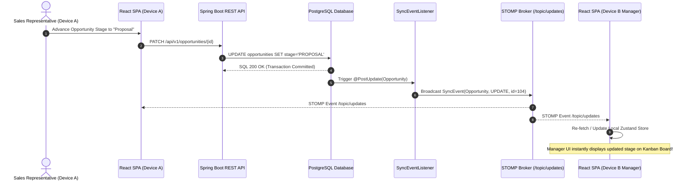
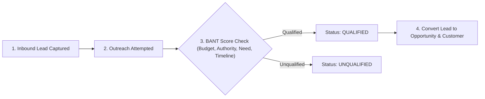
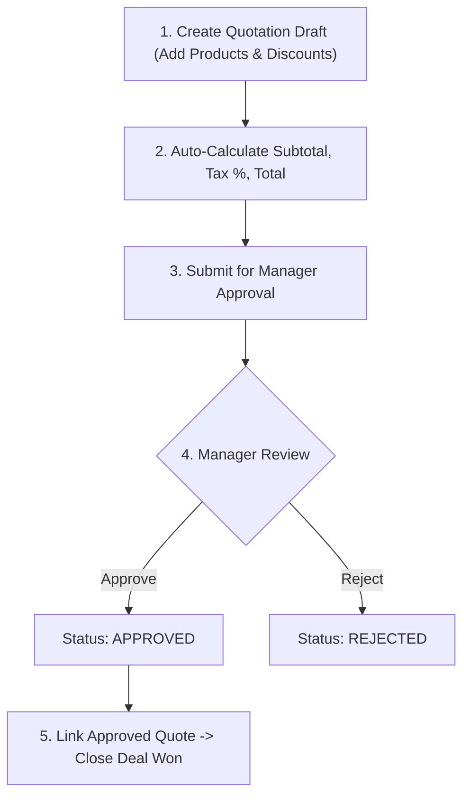

# Small Business Sales Manager (CRM)

[](https://github.com/Paras2611/Small_Biz_Sales_Manager/actions/workflows/ci-backend.yml)
[](https://github.com/Paras2611/Small_Biz_Sales_Manager/actions/workflows/ci-frontend.yml)

A high-integrity, enterprise-grade B2B Sales Management CRM application built for small and mid-sized enterprises.

The platform orchestrates the complete commercial lifecycle: **Lead Capture → BANT Qualification → Activity & Follow-up Management → Deal Opportunity Tracking → Multi-line Quotations & Commercial Approvals → Won Conversion & Revenue Analytics**.

---

### 🌐 Live Production Deployments
- 💻 **Frontend Web App (Vercel)**: [https://small-biz-sales-manager.vercel.app](https://small-biz-sales-manager.vercel.app)
- ⚙️ **Backend REST API & STOMP WebSockets (Render)**: [https://small-biz-sales-backend.onrender.com](https://small-biz-sales-backend.onrender.com)
- 📖 **Full System Details & Presentation Blueprint**: [`details.md`](file:///d:/Thinqlou_Software/details.md)

---

## 🏗️ 1. System Architecture



---

## ⚡ 2. Real-Time Atomic Sync Workflow Across Devices

All database modifications trigger JPA lifecycle hooks that broadcast events across active STOMP WebSocket client connections. Any action taken on one device reflects instantly across all logged-in devices without page refreshes.



---

## 🔄 3. Core Commercial Workflows

### Lead Capture & BANT Qualification Workflow



### Commercial Quotation & Approval Gate Workflow



---

## 🛠️ 4. Technology Stack

- **Backend**: Java 21, Spring Boot 3.3.4, Spring Web, Spring Data JPA, Hibernate ORM, Spring Security, JJWT (HMAC-SHA256), STOMP WebSockets, Maven
- **Frontend**: React 18, Vite, Tailwind CSS, Vanilla CSS Tokens, Lucide Icons, Axios, Recharts, `@stomp/stompjs`
- **Database**: Managed PostgreSQL on Render (with embedded H2 file fallback for zero-config local development)
- **AI Layer**: Google Gemini 1.5 Flash API for automated lead scoring, pitch generation, and deal probability analysis
- **Deployment**: Render (Java 21 Web Container + Managed PostgreSQL), Vercel (React SPA)

---

## 🔑 5. Pre-Seeded Demo Credentials

The backend automatically seeds demo records and credentials on first boot if the database is empty:

| Role | Name | Email | Password | Responsibilities |
| :--- | :--- | :--- | :--- | :--- |
| **Sales Executive** | Arjun Shah | `arjun.shah@salescrm.demo` | `Exec@2026` | Capture leads, log activities, create quotes |
| **Sales Manager** | Priya Mehta | `priya.mehta@salescrm.demo` | `Manager@2026` | Pipeline review, review & approve/reject quotes |
| **Administrator** | Admin User | `admin@salescrm.demo` | `Admin@2026` | User provisioning, product catalog, global settings |

---

## 📡 6. API Overview

All endpoints support `/api/v1/...` and `/api/...` prefixes.

### Authentication (`/api/v1/auth`)
- `POST /api/v1/auth/login` — Authenticate user and receive JWT bearer token
- `GET /api/v1/auth/me` — Retrieve authenticated user profile

### Leads (`/api/v1/leads`)
- `GET /api/v1/leads` — Filter leads by search, status, or owner
- `POST /api/v1/leads` — Create lead with optional inline customer creation
- `POST /api/v1/leads/{id}/qualify` — Execute BANT qualification checklist
- `POST /api/v1/leads/{id}/convert-opportunity` — Convert qualified lead into opportunity

### Opportunities (`/api/v1/opportunities`)
- `GET /api/v1/opportunities` — List opportunities by stage, status, owner
- `POST /api/v1/opportunities` — Create new deal opportunity
- `POST /api/v1/opportunities/{id}/mark-won` — Close won deal (requires approved quote ID)
- `POST /api/v1/opportunities/{id}/mark-lost` — Close lost deal with structured reason

### Quotations (`/api/v1/quotations`)
- `GET /api/v1/quotations` — List quotations
- `POST /api/v1/quotations` — Create quote with product line snapshots
- `POST /api/v1/quotations/{id}/approve` — Commercial approval (Manager / Admin)
- `POST /api/v1/quotations/{id}/reject` — Reject quotation with feedback

### Follow-Ups & Tasks (`/api/v1/followups`)
- `GET /api/v1/followups` — List follow-ups (`overdue`, `due_today`, `upcoming`)
- `POST /api/v1/followups` — Schedule call, meeting, demo, or email

### AI Advisory Layer (`/api/v1/ai`)
- `POST /api/v1/ai/lead-priority` — AI lead BANT prioritization (High/Medium/Low)
- `POST /api/v1/ai/lead-summary` — Strict 5-line executive deal summary
- `POST /api/v1/ai/next-action` — Next best commercial action recommendation

### Health Check (`/api/health`)
- `GET /api/health` — Service uptime, database check (`SELECT 1`), and status

---

## 🚀 7. Quickstart Local Setup

### Prerequisites
- **Java**: JDK 21+
- **Node.js**: 18+ (Node 20 / 22 recommended)
- **Git**

### Backend Setup (Spring Boot)

```bash
cd backend
./mvnw spring-boot:run
```
*(Windows PowerShell: `.\mvnw.cmd spring-boot:run`)*  
Backend starts at `http://localhost:8080`. Automatically falls back to embedded H2 if no PostgreSQL is configured.

To run full backend test suite (18 unit & integration tests):
```bash
./mvnw test
```

### Frontend Setup (React + Vite)

```bash
cd frontend
npm install
npm run dev
```
Frontend opens at `http://localhost:5173`.

---

## 📄 8. Further Documentation

For complete detailed architecture blueprints, entity relationship diagrams, database schemas, security filter specs, and presentation pitch defense guides, refer to **[`details.md`](file:///d:/Thinqlou_Software/details.md)**.
