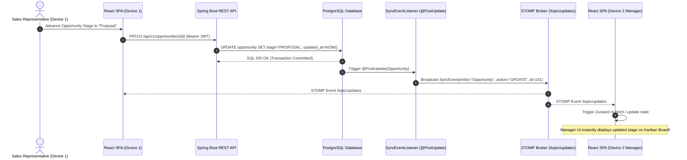
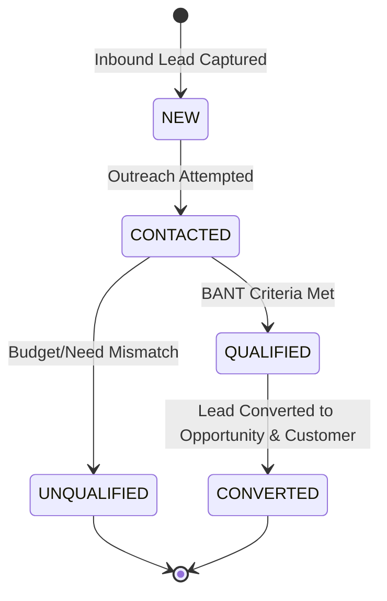
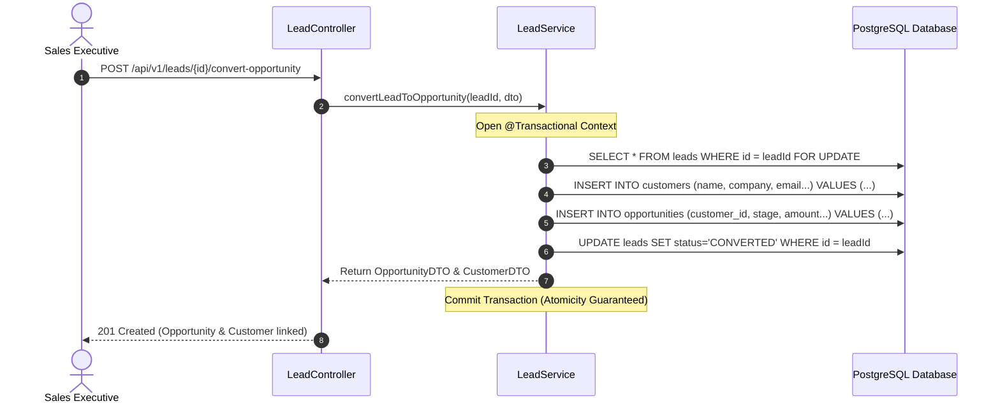
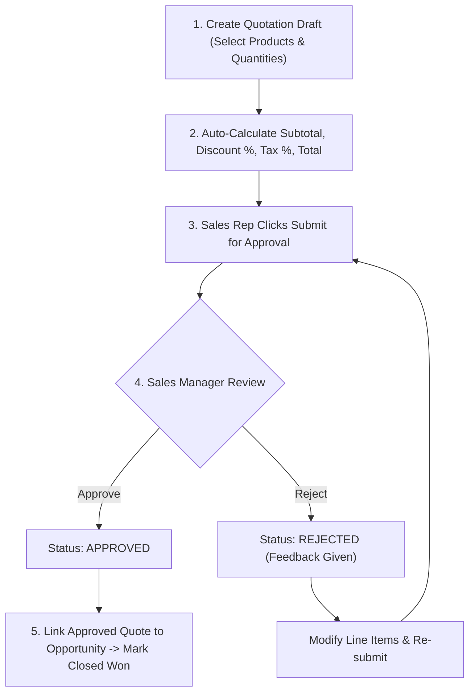
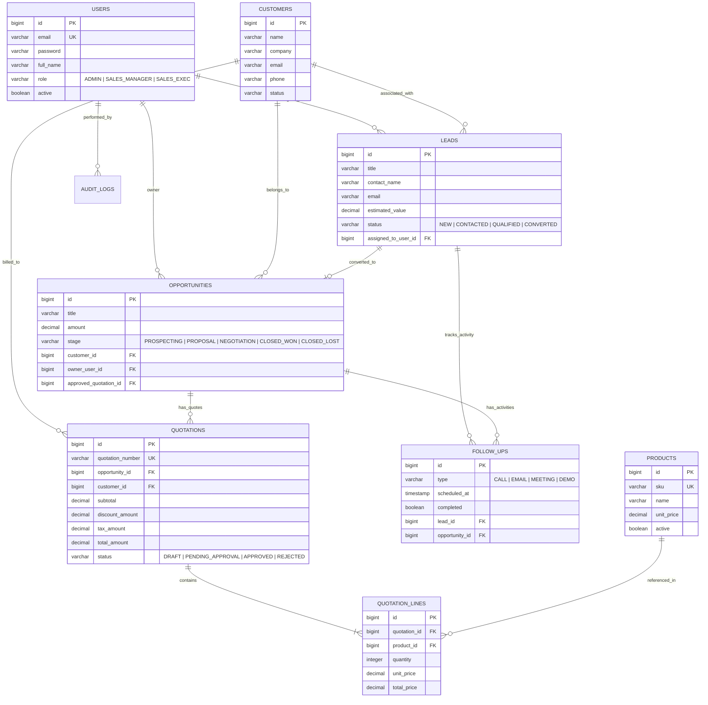

# Small Business Sales Manager (CRM) — Complete Technical & System Details

> **Comprehensive Reference & Architecture Document for Stakeholder Presentation**  
> *Live System URLs*:  
> 🌐 **Frontend Web Application (Vercel)**: [https://small-biz-sales-manager.vercel.app](https://small-biz-sales-manager.vercel.app)  
> ⚙️ **Backend REST API & STOMP WebSockets (Render)**: [https://small-biz-sales-backend.onrender.com](https://small-biz-sales-backend.onrender.com)  

---

## 📋 Table of Contents
1. [Executive Summary & Core Value Proposition](#1-executive-summary--core-value-proposition)
2. [High-Level System Architecture](#2-high-level-system-architecture)
3. [Atomic Cross-Device Synchronization Engine](#3-atomic-cross-device-synchronization-engine)
4. [End-to-End Business Workflows](#4-end-to-end-business-workflows)
   - [Workflow A: Lead Capture & BANT Qualification](#workflow-a-lead-capture--bant-qualification)
   - [Workflow B: Atomic Lead-to-Opportunity Conversion](#workflow-b-atomic-lead-to-opportunity-conversion)
   - [Workflow C: Quotation Commercial Calculation & Approval Gate](#workflow-c-quotation-commercial-calculation--approval-gate)
   - [Workflow D: Activity & Overdue Follow-up Tracking](#workflow-d-activity--overdue-follow-up-tracking)
   - [Workflow E: AI Sales Advisory & Deal Scoring](#workflow-e-ai-sales-advisory--deal-scoring)
5. [Entity-Relationship Diagram (Database Schema)](#5-entity-relationship-diagram-database-schema)
6. [Security & Authentication Architecture](#6-security--authentication-architecture)
7. [API & STOMP WebSocket Protocol Specs](#7-api--stomp-websocket-protocol-specs)
8. [Cloud Infrastructure & Deployment Topology](#8-cloud-infrastructure--deployment-topology)
9. [Presentation & Live Demo Cheat Sheet](#9-presentation--live-demo-cheat-sheet)

---

## 1. Executive Summary & Core Value Proposition

Small and Mid-Sized Enterprises (SMEs) face revenue leakage due to fragmented lead management, untracked follow-ups, inaccurate manual quotation math, and lack of real-time pipeline visibility across devices.

**Small Business Sales Manager** resolves these pain points by serving as an end-to-end commercial operations system with:
- **Strict Data Integrity**: All CRUD operations are executed directly against the database within transactional boundaries.
- **Real-Time Multi-Device Atomic Sync**: Every mutation (create, update, delete) triggers a JPA Lifecycle event that broadcasts over STOMP WebSockets, updating all connected desktop, mobile, and web UI instances simultaneously without page reloads.
- **AI-Powered Sales Coaching**: Built-in Google Gemini 1.5 Flash AI integration provides one-click BANT lead scoring, personalized pitch generation, and win probability estimations.
- **Commercial Governance**: Multi-line quotation calculations enforce `BigDecimal` rounding precision and manager approval gates before deals can be marked `Closed Won`.

---

## 2. High-Level System Architecture

The application is structured into decoupled layers: a React 18 Single Page Application (SPA) hosted on Vercel, connected over HTTPS and STOMP WebSockets to a Java 21 / Spring Boot 3 backend deployed on Render, backed by a PostgreSQL database.

```mermaid
graph TD
    classDef client fill:#1f2937,stroke:#3b82f6,stroke-width:2px,color:#fff;
    classDef backend fill:#111827,stroke:#10b981,stroke-width:2px,color:#fff;
    classDef external fill:#1e1b4b,stroke:#8b5cf6,stroke-width:2px,color:#fff;
    classDef db fill:#312e81,stroke:#f59e0b,stroke-width:2px,color:#fff;

    subgraph Client Layer ["Client Tier (Vercel CDN)"]
        UserDevice1["📱 Sales Rep Mobile App"]:::client
        UserDevice2["💻 Sales Manager Desktop Browser"]:::client
    end

    subgraph Application Layer ["Backend Services (Render Container Service)"]
        API Gateway["🌐 Spring Security & JWT Auth Filter"]:::backend
        Controllers["🕹️ REST Controllers (/api/v1/*)"]:::backend
        Services["⚙️ Business Service Layer (@Transactional)"]:::backend
        JPA Engine["🗄️ Spring Data JPA / Hibernate ORM"]:::backend
        SyncEngine["⚡ SyncEventListener (JPA Lifecycle Hooks)"]:::backend
        STOMPServer["📡 STOMP WebSocket Broker (/ws & /topic/updates)"]:::backend
        AIEngine["🤖 AI Advisory Service (Gemini + Deterministic Fallback)"]:::backend
    end

    subgraph Infrastructure Layer ["Data & External Services"]
        Database[("🐘 Render Managed PostgreSQL Database")]:::db
        GeminiAPI["🧠 Google Gemini 1.5 Flash AI API"]:::external
    end

    UserDevice1 -->|REST API HTTPS| API Gateway
    UserDevice2 -->|REST API HTTPS| API Gateway
    UserDevice1 <-->|WSS / STOMP WebSockets| STOMPServer
    UserDevice2 <-->|WSS / STOMP WebSockets| STOMPServer

    API Gateway --> Controllers
    Controllers --> Services
    Services --> JPA Engine
    Services --> AIEngine
    AIEngine <-->|HTTPS REST| GeminiAPI

    JPA Engine <-->|JDBC SQL| Database
    JPA Engine -->|@PostPersist / @PostUpdate / @PostRemove| SyncEngine
    SyncEngine -->|Broadcast Update Event| STOMPServer
```

---

## 3. Atomic Cross-Device Synchronization Engine

When any CRUD operation occurs on any device (e.g., creating a lead, advancing an opportunity stage, approving a quote), the update must immediately reflect across all active sessions.



---

## 4. End-to-End Business Workflows

### Workflow A: Lead Capture & BANT Qualification
Leads enter as `NEW` or `CONTACTED`. Sales representatives score them using the BANT framework (Budget, Authority, Need, Timeline).



---

### Workflow B: Atomic Lead-to-Opportunity Conversion
When a lead is marked `QUALIFIED`, converting it creates both a `Customer` entity and an `Opportunity` entity in a single atomic database transaction.



---

### Workflow C: Quotation Commercial Calculation & Approval Gate
Commercial quotations support multi-product line items with automatic subtotal, discount, tax, and total pricing calculations. To prevent unauthorized discounts, deals cannot be marked `Closed Won` without a Manager-Approved quotation.



---

### Workflow D: Activity & Overdue Follow-up Tracking
Sales reps log interactions (Calls, Emails, Demos, Meetings). The system automatically evaluates scheduled follow-up timestamps against system clock `Instant.now()`.

```mermaid
gantt
    title Scheduled Activity & Overdue Tracking Timeline
    dateFormat  YYYY-MM-DD HH:mm
    axisFormat %H:%m

    section Activity Logging
    Call Logged with Customer A      :done,    act1, 2026-09-27 10:00, 10:15
    Scheduled Demo Follow-up        :active,  act2, 2026-09-27 11:00, 11:30
    Overdue Alert Triggered (due_at < now) :crit, act3, 2026-09-27 11:31, 12:00
```

---

### Workflow E: AI Sales Advisory & Deal Scoring
Integrated with **Google Gemini 1.5 Flash**, the system provides:
1. **AI Lead Scoring**: Evaluates deal fit, company size, and budget to output a 0-100 score + recommendation.
2. **AI Email Draft Generator**: Drafts tailored follow-up pitches based on recent lead communications.
3. **AI Win Probability Estimator**: Predicts deal closing probability for active opportunities.

---

## 5. Entity-Relationship Diagram (Database Schema)

The PostgreSQL database enforces strict relational integrity, foreign key constraints, and cascading rules across 9 core entities:



---

## 6. Security & Authentication Architecture

Authentication uses stateless **JSON Web Tokens (JWT)** signed via **HMAC-SHA256**.

```mermaid
graph LR
    Client["React Frontend SPA"] -->|1. POST /auth/login {email, password}| AuthController["JwtAuthenticationFilter"]
    AuthController -->|2. Verify Credentials| UserDetailsService["CustomUserDetailsService"]
    UserDetailsService -->|3. Issue JWT Token| JwtProvider["JwtTokenProvider"]
    JwtProvider -->|4. Return Token & Role| Client
    Client -->|5. HTTP Request + Header: 'Authorization: Bearer <token>'| SecurityFilter["Spring Security Filter Chain"]
    SecurityFilter -->|6. Populate SecurityContext| ProtectedEndpoint["Rest API Endpoint (@PreAuthorize)"]
```

### Role-Based Access Control (RBAC) Matrix

| Feature / Resource | Sales Executive (`SALES_EXEC`) | Sales Manager (`SALES_MANAGER`) | System Administrator (`ADMIN`) |
| :--- | :---: | :---: | :---: |
| View Own Leads & Deals | ✅ | ✅ | ✅ |
| View Team Leads & Deals | ❌ | ✅ | ✅ |
| Create Leads & Opportunities | ✅ | ✅ | ✅ |
| Create Quotations | ✅ | ✅ | ✅ |
| **Approve / Reject Quotations** | ❌ | ✅ | ✅ |
| **Mark Deal Closed Won** | ❌ (Requires Approved Quote) | ✅ | ✅ |
| Product Catalog Management | ❌ | ❌ | ✅ |
| User Provisioning & Roles | ❌ | ❌ | ✅ |

---

## 7. API & STOMP WebSocket Protocol Specs

### Core REST Endpoints Summary

| Endpoint | Method | Role Allowed | Description |
| :--- | :---: | :---: | :--- |
| `/api/v1/auth/login` | `POST` | Public | Authenticate user & get JWT |
| `/api/v1/leads` | `GET`, `POST` | Exec, Manager, Admin | List or create leads |
| `/api/v1/leads/{id}/convert-opportunity` | `POST` | Exec, Manager, Admin | Convert qualified lead |
| `/api/v1/opportunities` | `GET`, `POST`, `PATCH` | Exec, Manager, Admin | Manage pipeline deals |
| `/api/v1/quotations` | `GET`, `POST` | Exec, Manager, Admin | Manage quotations |
| `/api/v1/quotations/{id}/approve` | `POST` | Manager, Admin | Commercial approval gate |
| `/api/v1/ai/lead-priority` | `POST` | Exec, Manager, Admin | Generate AI BANT score |
| `/api/health` | `GET` | Public | Health check & uptime |

### Real-Time STOMP WebSocket Protocol Specs

- **Connection Endpoint**: `wss://small-biz-sales-backend.onrender.com/ws`
- **Subscribed Topic**: `/topic/updates`
- **Sample Event Broadcast Payload**:
```json
{
  "entity": "Opportunity",
  "action": "UPDATE",
  "id": "104",
  "timestamp": "2026-09-27T03:15:00Z"
}
```

---

## 8. Cloud Infrastructure & Deployment Topology

```mermaid
flowchart LR
    subgraph Vercel ["Vercel Global CDN (Frontend)"]
        ReactApp["React 18 SPA (Vite Build)"]
    end

    subgraph Render ["Render Cloud (Singapore Region)"]
        DockerApp["Java 21 Spring Boot Web Container"]
        PostgresDB[("Managed PostgreSQL DB")]
    end

    ReactApp -->|REST API Calls (HTTPS)| DockerApp
    ReactApp <-->|STOMP WebSockets (WSS)| DockerApp
    DockerApp <-->|Internal JDBC Connection| PostgresDB
```

---

## 9. Presentation & Live Demo Cheat Sheet

### 🚀 Key Highlights for Presentation Demo:

1. **Live Multi-Device Demo**:
   - Open Vercel UI on Desktop and Mobile side-by-side.
   - Move a deal on Desktop Kanban Board → Watch Mobile UI update instantaneously via STOMP WebSockets without page reload!
2. **AI Lead Scoring**:
   - Open Lead Detail page → Click **"Generate AI Score"** → View Gemini 1.5 Flash BANT evaluation.
3. **Quotation Approval Gate**:
   - Attempt to mark an opportunity `Closed Won` without approval → Show system enforcement error.
   - Log in as Manager (`priya.mehta@salescrm.demo`) → Approve Quotation → Watch Opportunity transition to Won.
4. **Pre-Seeded Demo Accounts**:
   - **Sales Executive**: `arjun.shah@salescrm.demo` / `Exec@2026`
   - **Sales Manager**: `priya.mehta@salescrm.demo` / `Manager@2026`
   - **Administrator**: `admin@salescrm.demo` / `Admin@2026`
